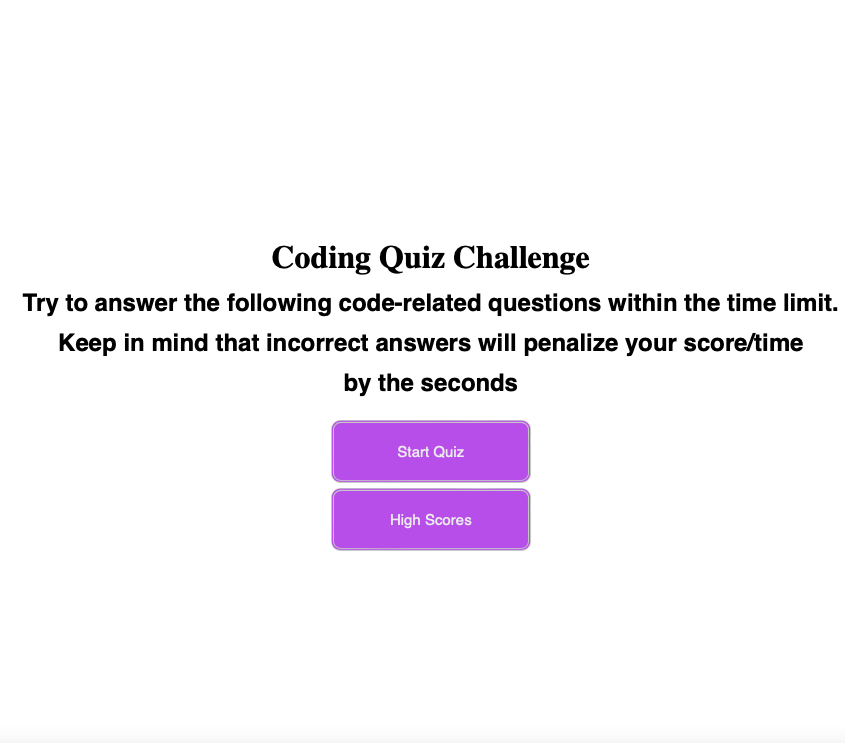

# 04 Web APIs: Code Quiz

This timed coding quiz is a combination of multiple-choice questions which uses JavaScript, HTML and CSS to allows users to capture their progress.  

This is how the front page looks:

## Website:
https://marinakaeufer.github.io/Catamaran-Web-APIs-Code-Quiz/

## Github:
https://github.com/MarinaKaeufer/Catamaran-Web-APIs-Code-Quiz
